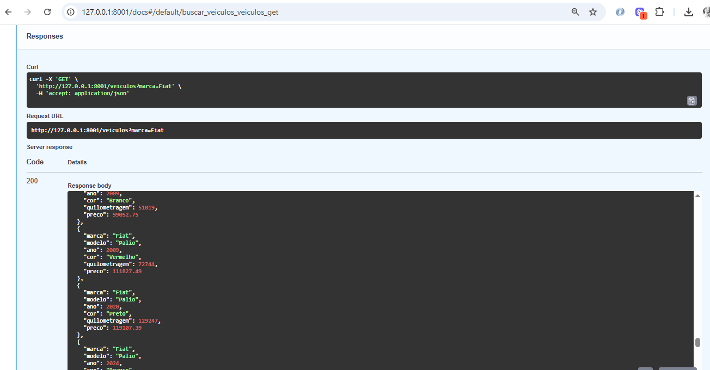

# 🚗 Car-IA

Aplicação interativa de busca de veículos no terminal, com comunicação entre cliente e servidor via protocolo MCP (Model Context Protocol). Este projeto foi desenvolvido como parte do desafio técnico para a vaga de Desenvolvedor Python na C2S.

---

## 🧭 Estrutura do Projeto

```
car-ia/
├── 🧠 agent/                     # Agente virtual (chat com o usuário no terminal)
│   └── main.py                   # Lógica de perguntas e interação com o usuário final
│
├── 📡 client/                    # Cliente MCP (camada de comunicação)
│   └── client.py                 # Envia os filtros da busca ao servidor
│
├── 🗃️ database/                  # Banco de dados local com SQLAlchemy
│   ├── models.py                 # Modelo da tabela `Veiculo`
│   ├── fill_table.py             # Script para gerar dados falsos (100 veículos)
│   └── db.py                     # Conexão e criação do SQLite
│
├── 🖥️ server/                    # Servidor MCP (lida com a lógica de busca)
│   ├── server.py                 # Interpreta filtros e responde com dados do banco
│   └── handlers.py               # Lógica auxiliar para futuras extensões
│   └── api.py                    # API REST com FASTAPI para consulta de veiculos
│
├── 🌐 streamlit/                 # Aplicação Streamlit
│   ├── index.py                  # Principal arquivo da apliação Streamlit
│
├── 📦 requirements.txt           # Lista de dependências do projeto
├── 📖 README.md                  # Documentação e instruções de uso
└── 🚀 run.py                     # Ponto de entrada da aplicação no terminal
```

---

## ⚙️ Como executar o projeto

### 1. Instalar as dependências

```bash
pip install -r requirements.txt
```

### 2. Popular o banco com dados simulados

```bash
python database/fill_table.py
```

### 3. Rodar a aplicação via terminal

```bash
python run.py
```


### 4. Rodar a aplicação via Streamlit

Linux
```bash
PYTHONPATH=$(pwd) streamlit run streamlit/index.py
```

Windows PowerShell
```bash
$env:PYTHONPATH = (Get-Location)
streamlit run streamlit/index.py
```

Windows CMD
```bash
set PYTHONPATH=%cd%
streamlit run streamlit/index.py
```

### 5. Rodar a aplicação via API com FastAPI

Com definição de porta
```bash
uvicorn server.api:app --reload --port <defina-porta-aqui>
```

Porta padrão
```bash
uvicorn server.api:app --reload
```

Observação

Ao iniciar o FastApi, ira abrir localmente na URL [http://127.0.0.1:8000](http://127.0.0.1:8000), porém será necessário adicionar o /docs no final da URL para entrar no Swagger.



---

## 🧩 Fluxo da Aplicação

```
Usuário / Streamlit
  │
  ▼
agent/ ➝ client/ ➝ server/ ➝ database/
                ⬅         ⬅
              Resposta formatada com carros compatíveis

ou

Usuário ➝ FastAPI REST ➝ server/database

```

---

## ✅ Funcionalidades

- Chat com agente virtual no terminal (nada de menu fixo!)
- Filtros flexíveis: marca, modelo, ano, motorizacao, combustível, cor, quilometragem, portas, transmissao, preço
- Banco SQLite com 100 veículos gerados via Faker
- Arquitetura cliente-servidor com protocolo MCP
- API REST disponível com FastAPI
